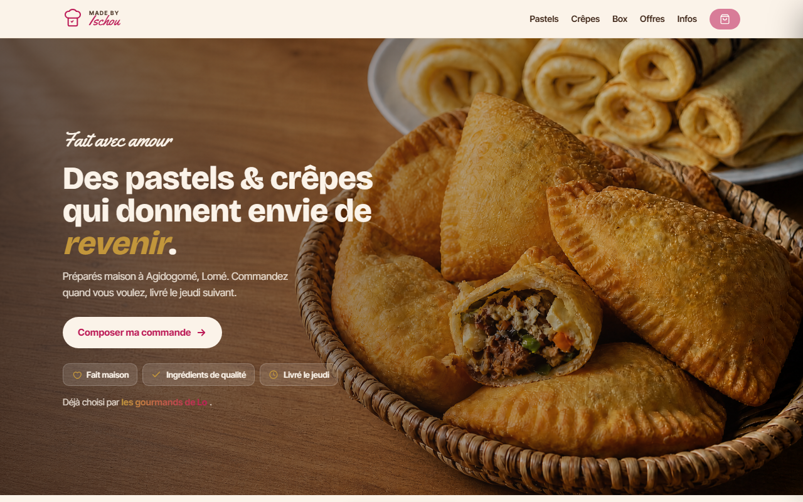
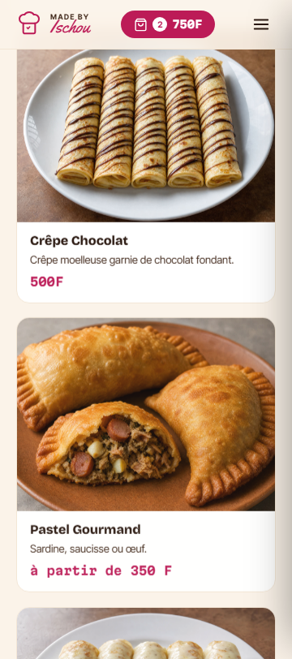
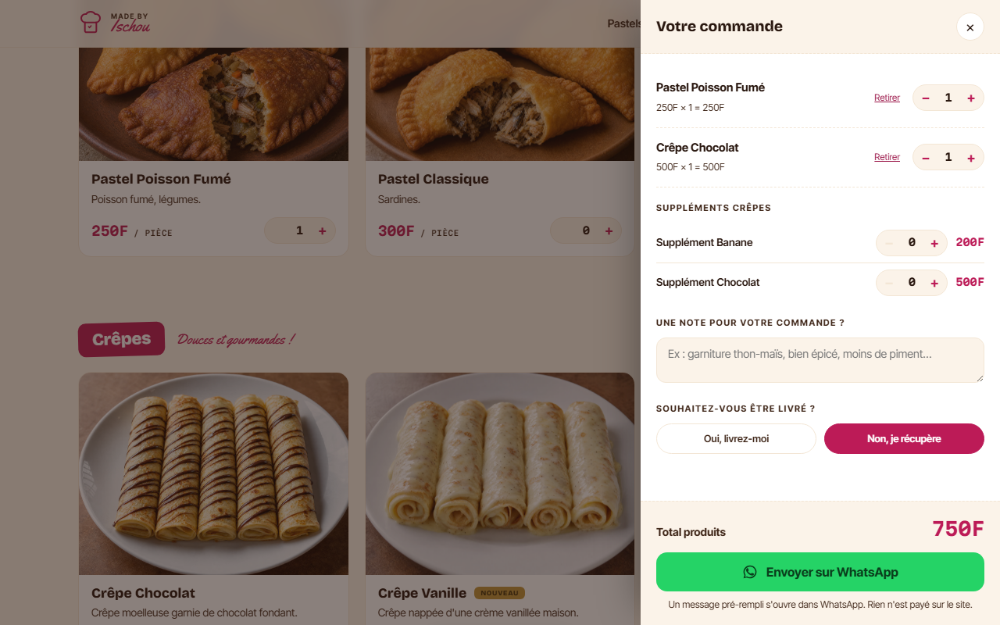
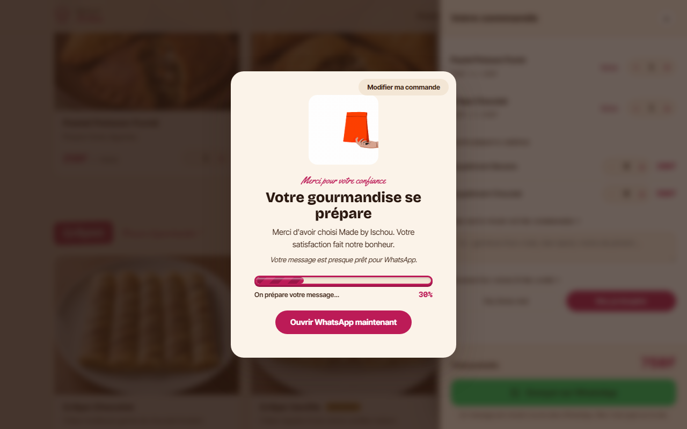

# Made by Ischou

Site mono-page de commande pour **Made by Ischou**, une marque artisanale de pastels et de crêpes faites maison à Lomé, au Togo.

Le site permet de découvrir le catalogue, de composer un panier, de choisir les suppléments et le mode de retrait ou de livraison, puis d’ouvrir un message WhatsApp prérempli. Il ne traite pas de paiement en ligne et ne possède pas de compte utilisateur.

> **Statut du dépôt :** le livrable applicatif principal est `index.html`. Avant la mise en production, la preview de test et les contrôles de validation doivent être exécutés sur un hébergement HTTPS ou un serveur local.

## Aperçu

| Hero desktop | Hero mobile |
| --- | --- |
|  |  |

| Panier / carnet de commande | Remerciement avant WhatsApp |
| --- | --- |
|  |  |

Une preview interactive du parcours de test est disponible ici : **[`docs/test-flow-preview.html`](docs/test-flow-preview.html)**. Elle affiche le site dans un cadre de démonstration et accompagne le test avec une checklist manuelle, un état de progression et les critères de validation.

## Fonctionnalités actuelles

Le site comprend une navigation mono-page par ancres, un héros basé sur le rythme de livraison hebdomadaire, les sections Pastels, Crêpes, Box et Offres, ainsi qu’un panier sous forme de carnet de commande. Les cartes produits ouvrent une fiche détaillée ; les contrôles `+` et `−` modifient les quantités sans ouvrir la fiche.

Le panier prend en charge les articles à prix fixe, le **Pastel Gourmand** à prix variable, les suppléments crêpes avec quantité propre, le mode take-away, la livraison à Lomé, la saisie d’une adresse et le partage volontaire de la position GPS. La commande finale est générée dans un format WhatsApp prérempli.

La page de remerciement utilise `assets/shoppingbag.gif`, une barre de progression déterministe de trois secondes et un bouton d’ouverture manuelle de WhatsApp. Le texte reste volontairement honnête : l’ouverture de WhatsApp prépare le message, mais la commande n’est confirmée qu’après l’envoi effectif dans WhatsApp.

| Domaine | Fonctionnement |
| --- | --- |
| Catalogue | Pastels, crêpes, box, offres et suppléments selon le catalogue validé |
| Panier | Ajout, retrait, augmentation, diminution, suppression et annulation de suppression |
| Suppléments | Banane `+200 F` et Chocolat `+500 F` |
| Livraison | Livraison à Lomé à partir de `1 000 F`, coût exact confirmé sur WhatsApp |
| Take-away | Retrait sur place à Agidogomé, Ave Maria, Rue Mélonku |
| GPS | Partage volontaire de la position avec lien Google Maps à six décimales |
| Commande | Message WhatsApp prérempli vers `71 30 39 11` |
| Accessibilité | Labels, ARIA, focus, fermeture par Échap et `prefers-reduced-motion` |
| Responsive | Cible de 360 px à 1 920 px |

## Catalogue de référence

Les prix et compositions doivent rester alignés sur [`PROMPT-CODEX-MAJ-CATALOGUE.md`](PROMPT-CODEX-MAJ-CATALOGUE.md). Ce fichier est la source de vérité métier ; les anciens flyers et les hypothèses générées ne doivent pas remplacer ses décisions.

| Produit | Prix | Composition ou contenu |
| --- | ---: | --- |
| Pastel Poisson Fumé | `250 F` | Poisson fumé, légumes |
| Pastel Classique | `300 F` | Sardines. |
| Pastel Gourmand | À partir de `350 F` | Sardine, saucisse ou œuf ; prix confirmé selon la garniture |
| Crêpe Chocolat | `500 F` | Crêpe moelleuse garnie de chocolat fondant |
| Crêpe Vanille | `500 F` | Crêpe nappée d’une crème vanillée maison |
| Crêpe Banane Chocolat | `500 F` | Crêpe, banane fraîche et chocolat fondant |
| Petite Box | `3 000 F` | 5 à 6 crêpes roulées + chocolat |
| Box Classique | `4 000 F` | 8 à 10 crêpes roulées + chocolat |
| Offre 5 Pastels | `1 000 F` | Tous pastels confondus |
| Offre 10 Pastels | `2 000 F` | Tous pastels confondus |

Les seuls suppléments payants actuellement documentés sont **Banane `+200 F`** et **Chocolat `+500 F`**. Le supplément Fraise est supprimé. Les éventuels extras gratuits doivent rester distincts des suppléments payants et ne doivent être affichés que s’ils sont confirmés dans le catalogue actif.

Le Pastel Gourmand doit conserver l’intitulé **« À partir de 350 F »**. Lorsque le panier contient ce produit variable, le total doit afficher **« Total estimé »** et le message WhatsApp doit contenir la ligne de confirmation prévue dans le brief catalogue.

## Parcours de commande

Le parcours nominal est le suivant :

```text
Accueil
  → choisir Pastels, Crêpes, Box ou Offres
  → ouvrir une fiche produit si nécessaire
  → utiliser + ou − pour régler la quantité
  → ouvrir le panier depuis l’en-tête
  → choisir les suppléments et les extras disponibles
  → choisir livraison ou take-away
  → indiquer une adresse ou partager volontairement le GPS
  → vérifier le total et la note
  → cliquer sur Envoyer sur WhatsApp
  → afficher le remerciement pendant 3 secondes
  → ouvrir WhatsApp avec le message prérempli
```

Les boutons de quantité sont des contrôles d’achat, pas des liens vers la fiche produit. Un clic sur `+` ou `−` ne doit jamais ouvrir une carte ni modifier l’URL. Le bouton WhatsApp ne doit pas vider le panier avant l’ouverture de l’application.

## Architecture technique

Le projet est volontairement léger :

| Élément | Choix actuel |
| --- | --- |
| Application | Un seul fichier `index.html` |
| Technologie | HTML, CSS et JavaScript inline |
| Build | Aucun build requis |
| Framework | Aucun framework |
| Serveur | Aucun backend applicatif |
| Commande | Lien `wa.me` avec message encodé par `encodeURIComponent` |
| Paiement | Aucun paiement sur le site |
| Stockage | Le comportement réel doit être vérifié contre les briefs normatifs avant production |
| Police | Google Fonts : Bricolage Grotesque, Inter Tight, Martian Mono et Yellowtail selon les usages documentés |

Les fichiers `AGENTS.md` et `CLAUDE.md` contiennent des contraintes normatives. Ils indiquent notamment que `PROMPT-CODEX-MAJ-CATALOGUE.md` est la source unique du catalogue, que `PROMPT-CODEX-TIMER.md` gouverne le timer et que `index-v1.html` ne sert que de référence pour le format WhatsApp et la géolocalisation.

## Structure du dépôt

```text
.
├── index.html                         # Application complète : HTML, CSS et JavaScript inline
├── favicon.svg                        # Favicon de la marque
├── icon.svg                           # Icône de marque
├── logo.svg                           # Logo de marque
├── assets/
│   ├── shoppingbag.gif                # Animation de remerciement
│   ├── hero section photo/
│   │   └── made_by_ischou_hero_tabletop.png
│   ├── images box crepes/
│   │   ├── crepe_box_chocolate_banana_client_style.png
│   │   ├── crepe_box_chocolate_client_style.png
│   │   └── crepe_box_vanilla_client_style.png
│   └── pastels_et_crepes_jpeg/
│       ├── pastel-classique.jpg
│       ├── pastel-gourmand.jpg
│       ├── pastel-poisson-fume.jpg
│       ├── crepe-chocolat.jpg
│       ├── crepe-vanille.jpg
│       └── crepe-banane-chocolat.jpg
├── docs/
│   ├── preview-hero-desktop.png
│   ├── preview-hero-mobile.png
│   ├── preview-drawer.png
│   ├── preview-thankyou.png
│   ├── test-flow-preview.html            # Preview interactive du parcours de test
│   └── TEST-FLOW.md                      # Scénario QA détaillé
├── AGENTS.md
├── CLAUDE.md
├── LISEZ-MOI.md
├── LOGO.md
├── PROMPT-CODEX-MAJ-CATALOGUE.md
├── PROMPT-CODEX-REFONTE.md
├── ROADMAP.md
└── README.md
```

## Assets et identité visuelle

Les assets de marque utilisent `currentColor` et doivent respecter [`LOGO.md`](LOGO.md). Ne pas ajouter d’ombre, de dégradé décoratif ou de recoloration indépendante du feston. Les images produits doivent conserver leur chemin réel et leur nom canonique dans le catalogue.

Le GIF `assets/shoppingbag.gif` est utilisé uniquement dans l’overlay de remerciement. Une absence d’image ne doit pas rendre le site inutilisable : chaque zone visuelle doit posséder un fallback textuel ou typographique cohérent.

## Lancer le site localement

Pour une vérification simple, un serveur HTTP local est préférable à l’ouverture directe de `file://`, notamment pour tester les assets et la géolocalisation. Depuis la racine du dépôt :

```bash
python3 -m http.server 4173
```

Puis ouvrir :

```text
http://localhost:4173/index.html
```

Pour lancer la preview du parcours de test :

```text
http://localhost:4173/docs/test-flow-preview.html
```

La géolocalisation du navigateur exige généralement un contexte sécurisé. En production, utiliser un hébergement HTTPS et toujours conserver la saisie manuelle d’adresse comme chemin principal de secours.

## Preview et test manuel

La preview interactive ne remplace pas un test end-to-end automatisé. Elle sert de cockpit QA visuel : elle affiche le vrai `index.html` dans un iframe, rappelle l’ordre des actions et permet de cocher les contrôles réalisés.

Le scénario de référence est disponible dans [`docs/TEST-FLOW.md`](docs/TEST-FLOW.md). Il couvre le chargement, la navigation, les cartes produits, les boutons `+ / −`, le panier, les suppléments, le mode de livraison, la page de remerciement et le lien WhatsApp.

Les contrôles minimaux avant mise en ligne sont :

1. aucune erreur JavaScript dans la console ;
2. aucun asset en erreur 404 ;
3. `+` et `−` modifient uniquement la quantité ;
4. le total inclut les suppléments ;
5. la composition du Pastel Classique reste exactement « Sardines. » ;
6. le Pastel Gourmand affiche « À partir de 350 F » et « Total estimé » lorsqu’il est sélectionné ;
7. le supplément Fraise n’apparaît pas ;
8. la page de remerciement dure environ trois secondes ;
9. WhatsApp reçoit le message attendu ;
10. le rendu reste utilisable à 360 px de largeur ;
11. le site reste navigable au clavier et avec `prefers-reduced-motion`.

## Règles de contribution

Avant toute modification, lire `AGENTS.md`, `CLAUDE.md` et les briefs normatifs. Ne pas corriger le site à partir d’une capture ou d’un ancien flyer si cela contredit le catalogue officiel. Préférer une modification ciblée et vérifiable à une réécriture globale.

Toute nouvelle fonctionnalité doit préciser son impact sur le panier, le message WhatsApp, l’accessibilité, les performances mobiles et les chemins d’assets. Toute information commerciale non présente dans les fichiers de référence doit être confirmée avant d’être ajoutée.

## Feuille de route

La feuille de route détaillée se trouve dans [`ROADMAP.md`](ROADMAP.md). Les prochains contrôles prioritaires concernent le piège de focus du carnet, l’annulation après suppression, le flux livraison/GPS, le format exact du message WhatsApp, le responsive 360–1 920 px, le contraste et l’absence d’erreur console.

## Licence et statut

Projet privé de **Made by Ischou**. Les textes, visuels et éléments de marque restent soumis à l’autorisation de la propriétaire.
