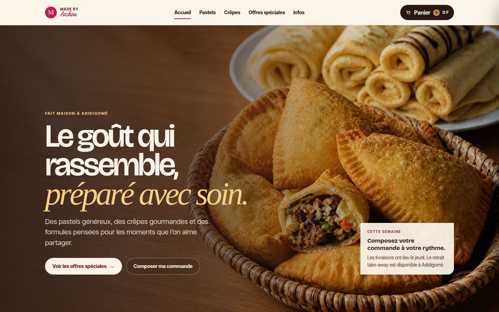
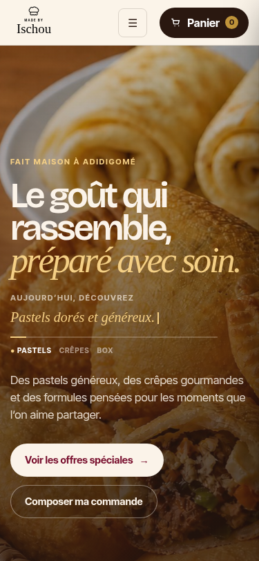
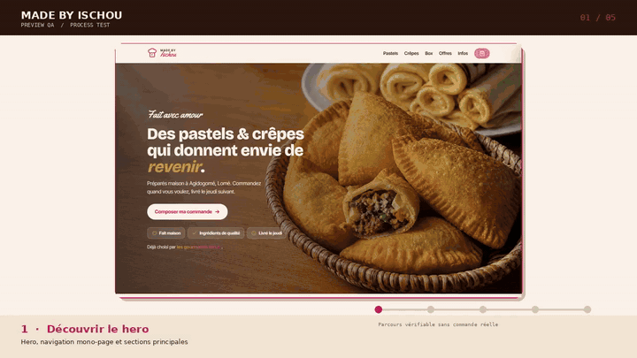

# Made by Ischou

Landing page mono-page de commande WhatsApp pour **Made by Ischou**, atelier artisanal de pastels et crêpes faits maison à **Adidigomé, Lomé**.

Le site public est déployé sur [ischou.vercel.app](https://ischou.vercel.app). Il permet de parcourir le catalogue, composer une commande, appliquer le supplément Banane lorsque le produit y est éligible, choisir le retrait ou la livraison, puis ouvrir un message WhatsApp prérempli. Aucun paiement ni compte client n’est demandé sur le site.

> **Principe de transparence :** les prix, recettes et quantités viennent exclusivement des décisions validées par la cliente. Les visuels doivent représenter des portions généreuses et ne doivent jamais faire croire à une mini-portion.

## Aperçu

| Hero desktop — refonte actuelle | Hero mobile — identité restaurée |
| --- | --- |
|  |  |

La vidéo historique du parcours QA reste disponible via l’aperçu animé ci-dessous. La refonte actuelle conserve le panier, la géolocalisation et le popup, tout en actualisant les sections et le catalogue.

[](docs/preview-test-flow.mp4)

## Expérience publique

La page suit une narration éditoriale inspirée de principes observables sur [Pear](https://pear.no/) — une phrase manifeste, des compositions asymétriques et une progression calme — sans reprendre sa marque, son code, ses textes, ses visuels ni son identité graphique.[1]

| Section | Rôle |
| --- | --- |
| Accueil | Présente la promesse, le rythme de commande et l’accès rapide aux offres. |
| Pastels | Réunit les trois pastels individuels et leurs steppers de quantité. |
| Crêpes | Présente les deux crêpes individuelles avec une référence visuelle de longueur généreuse. |
| Offres spéciales | Regroupe les six box de crêpes et les six formules de pastels, avec quantités et prix séparés. |
| Infos | Rappelle livraison, retrait, contacts et règle de supplément. |
| Panier | Centralise les produits, les suppléments, la livraison, une note et le message WhatsApp. |

Les ancres du menu gardent le visiteur sur une seule page. Les interactions n’utilisent pas de slider automatique, de vidéo lourde ni de calcul permanent au scroll.

## Catalogue validé

| Famille | Produit | Prix | Contenu ou quantité |
| --- | --- | ---: | --- |
| Pastel | Pastel Poisson fumé | `250 F` | Poisson fumé, légumes. |
| Pastel | Pastel Classique | `300 F` | Sardines. |
| Pastel | Pastel Gourmand | À partir de `350 F` | Garniture au choix : sardine, saucisse ou œuf. |
| Crêpe | Crêpe Chocolat | `500 F` | Crêpe longue et moelleuse garnie de chocolat fondant. |
| Crêpe | Crêpe Vanille | `300 F` | Crêpe longue et souple à la vanille. |
| Box | Petite Box Vanille | `1 500 F` | 7 crêpes roulées à la vanille. |
| Box | Petite Box Chocolat | `2 500 F` | 6 crêpes roulées au chocolat. |
| Box | Petite Box Chocolat-Banane | `3 500 F` | 6 crêpes roulées au chocolat et à la banane. |
| Box | Box Classique Vanille | `2 400 F` | 10 crêpes roulées à la vanille. |
| Box | Box Classique Chocolat | `4 000 F` | 9 crêpes roulées au chocolat. |
| Box | Box Classique Chocolat-Banane | `5 600 F` | 9 crêpes roulées au chocolat et à la banane. |
| Formule | 5 Pastels Poisson fumé | `1 000 F` | 5 pastels fixes. |
| Formule | 5 Pastels Classique | `1 200 F` | 5 pastels fixes. |
| Formule | 5 Pastels Gourmand | `1 500 F` | 5 pastels fixes. |
| Formule | 11 Pastels Poisson fumé | `2 000 F` | 11 pastels fixes. |
| Formule | 11 Pastels Classique | `2 400 F` | 11 pastels fixes. |
| Formule | 11 Pastels Gourmand | `3 000 F` | 11 pastels fixes. |

Le seul supplément payant actif est **Banane `+200 F`**. Il est calculé par crêpe individuelle ou par box et n’apparaît jamais pour les pastels ou les formules de pastels. Le supplément Chocolat, Fraise et « autre garniture » sont absents.

## Commande WhatsApp

Le panier reste partagé pendant la navigation et peut restaurer les quantités après un rechargement. Il ne stocke ni adresse, ni nom, ni position GPS. Les étapes sont les suivantes :

```text
Choisir les produits
  → ajuster les quantités avec − / +
  → ajouter Banane si le produit est une crêpe ou une box
  → choisir retrait ou livraison
  → saisir une adresse ou partager volontairement le GPS
  → préparer le message
  → voir le popup de remerciement pendant 7 secondes
  → ouvrir WhatsApp avec le message prérempli
```

Les frais de livraison ne sont pas inclus dans le total tant qu’un barème par zone n’a pas été validé. Lorsque la livraison est sélectionnée, le message WhatsApp demande explicitement la confirmation de ce coût. Le panier affiche **« Total estimé »** lorsqu’il contient un Pastel Gourmand.

## Performance et accessibilité

La landing page est pensée pour une connexion mobile parfois lente. Une seule image est prioritaire dans le hero ; les autres images sont différées avec `loading="lazy"`, bénéficient de dimensions explicites et sont comprimées en JPEG. Les révélations de section reposent sur `IntersectionObserver`, et les animations se limitent à `transform` et `opacity`.

Le site inclut un lien d’évitement, des labels explicites, des focus visibles, des cibles tactiles, une fermeture par Échap du panier et du popup, ainsi qu’un mode `prefers-reduced-motion` qui désactive les animations non essentielles.

## Visuels et vérité de portion

Les repères de taille sont documentés dans [`docs/REFONTE-PEAR-PERFORMANCE.md`](docs/REFONTE-PEAR-PERFORMANCE.md). Les prompts prêts à copier pour les six box et les six formules de pastels se trouvent dans [`docs/PROMPTS-VISUELS-OFFRES.md`](docs/PROMPTS-VISUELS-OFFRES.md).

Les photos de calibration des pastels et des crêpes sont intégrées pour rendre la taille des portions perceptible. Les douze photos fournies pour les six box et les six formules sont désormais optimisées, reliées une à une à leur card par un nom de fichier explicite et affichent aussi la quantité annoncée dans la carte. Une future photo doit être vérifiée visuellement avant remplacement si son nombre de pièces semble différent du produit vendu.

## Architecture

| Élément | Choix |
| --- | --- |
| Application publique | `index.html` unique, HTML, CSS et JavaScript inline. |
| Hébergement | Vercel, déploiement automatique depuis `main`. |
| Commande | Lien `wa.me` avec texte encodé via `encodeURIComponent`. |
| Panier | État navigateur et restauration locale de quantités sans donnée personnelle. |
| Paiement | Aucun paiement en ligne. |
| Backend | Aucun dans cette landing page statique. |
| Administration | Migration full-stack sécurisée prévue séparément ; `/adminrootonly` ne doit pas être ajouté à ce site statique comme faux accès protégé. |

## Déploiement Vercel

Le projet Vercel est relié au dépôt `BROU01/Made_by_ischou_bake`, branche `main`. Toute mise à jour poussée sur cette branche entraîne un nouveau déploiement. Vérifiez le statut **Ready** dans l’onglet **Deployments**, puis ouvrez [https://ischou.vercel.app](https://ischou.vercel.app). Un rechargement forcé peut être nécessaire après un changement important.

## Contrôles avant communication client

1. Vérifier que les 17 cartes (3 pastels, 2 crêpes, 6 box et 6 formules) s’affichent avec les prix ci-dessus.
2. Confirmer que `−` est visible, désactivé à zéro et ne provoque aucune ouverture de fiche.
3. Vérifier que Banane est proposée uniquement sur une crêpe ou une box et ajoute exactement `200 F`.
4. Vérifier le message WhatsApp, le total, la livraison et l’alternative d’adresse au GPS.
5. Vérifier que le popup reste ouvert sept secondes avant WhatsApp.
6. Vérifier la page sur un téléphone réel et une connexion mobile.
7. Vérifier manuellement chaque nouvelle image de box ou formule avant publication, en comptant les pièces visibles.

## Fichiers principaux

```text
index.html                            # Landing page publique complète
assets/refonte/                       # Photos de calibration JPEG optimisées
assets/offres/                        # Douze photos associées aux six box et six formules
assets/pastels_et_crepes_jpeg/        # Photos individuelles existantes
docs/REFONTE-PEAR-PERFORMANCE.md      # Direction visuelle et performance
docs/PROMPTS-VISUELS-OFFRES.md        # Prompts des images à générer
docs/TEST-FLOW.md                     # Scénario QA historique à mettre à jour au besoin
AGENTS.md / CLAUDE.md                 # Règles consolidées du dépôt
todo.md                               # Suivi de la refonte
```

## Prochaine étape : administration sécurisée

L’administration ne doit pas être masquée derrière une simple URL dans une page statique : son code et ses données resteraient inspectables. La phase suivante consiste à adapter le projet full-stack créé séparément, avec authentification réelle, rôle administrateur, base de données, API protégées et journal des modifications, puis à choisir le mode d’hébergement Vercel compatible avec cette architecture.

## Licence et statut

Les textes, visuels et éléments de marque sont utilisés uniquement avec l’autorisation de **Made by Ischou**. Aucun avis client, prix, recette ou information commerciale ne doit être inventé.

## References

[1]: https://pear.no/ "Pear — référence de principes de mise en scène"
