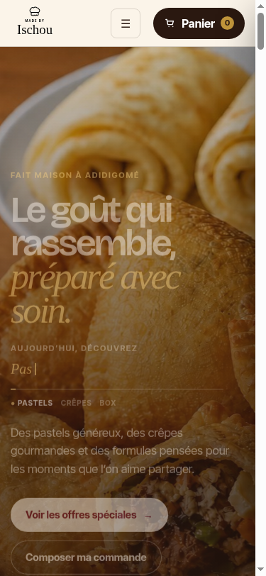

# QA — Progress bar Candy Crush/Pirouline

Date de vérification : 27 août 2026

## Éléments intégrés

| Élément | Résultat |
| --- | --- |
| Conteneur | Capsule rose pâle avec contour framboise, relief bas et ombre interne. |
| Remplissage | Rayures diagonales framboise et ivoire, reflet bombé en partie haute et éclat traversant. |
| Minuteur | Le compte à rebours conserve une durée de 7 000 ms. |
| Accessibilité | Le conteneur garde le rôle `progressbar`, les valeurs ARIA et le compteur textuel. |
| Réduction de mouvement | Les rayures et l’éclat s’arrêtent avec `prefers-reduced-motion: reduce`. |
| WhatsApp | La logique de préparation, du bouton manuel et de la redirection finale n’a pas été modifiée. |

## Contrôles effectués

Le popup a été ouvert avec une commande temporaire. À 58 %, la barre, les rayures et les reflets étaient affichés, la valeur `aria-valuenow` était synchronisée, et la configuration de sept secondes était présente. Le test n’a pas envoyé de message WhatsApp.

La capture mobile du hero confirme que la navigation, le logo, le panier et les CTA restent lisibles à 375 pixels de largeur. La capsule de progression utilise une largeur fluide et respecte la largeur disponible du popup.

## Capture

