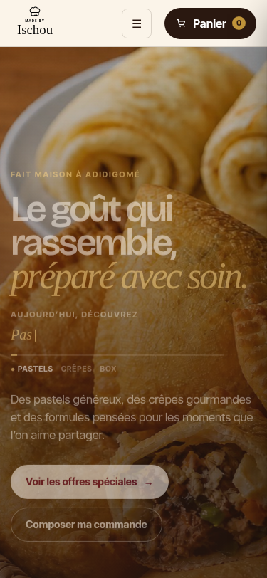

# QA — Motion de scroll éditoriale

Date de vérification : 27 août 2026

La landing locale a été ouverte après l’intégration des nouvelles classes de motion. Le hero, le panier, les contrôles de quantité et le typewriter se chargent toujours. La transition entre le hero et l’atelier déclenche une entrée séquencée : le bloc éditorial arrive depuis la gauche et les étapes de commande depuis la droite. Le premier chapitre produit révèle ensuite un numéro discret « 01 », sa ligne dorée et son contenu. Après stabilisation de l’animation, le contenu est pleinement lisible.

Les effets ajoutés restent concentrés sur `opacity` et `transform`. La parallaxe ne s’active que sur grand écran pour le portrait de crêpes et l’orbite décorative de la section des offres ; elle est absente sous 960 px et entièrement désactivée par `prefers-reduced-motion`.

## Contrôles restants avant publication

| Contrôle | État |
| --- | --- |
| Rendu desktop au repos après animation | Validé pour le hero, l’atelier et le premier chapitre. |
| Rendu mobile sans débordement horizontal | Validé sur capture 375 × 812 px : logo, menu, panier, hero et CTA restent dans la largeur disponible. Les effets de profondeur sont volontairement désactivés à cette largeur. |
| Absence d’erreur JavaScript | Vérification structurelle validée : 8 scènes sont détectées, 3 sont déjà révélées à la position contrôlée, 2 plans de profondeur sont présents et aucun débordement horizontal n’est détecté à 1 280 px. Au niveau de la scène Crêpes, le visuel principal reçoit une translation de -2 px avec une échelle de 1,06 ; l’orbite des Offres reçoit une translation de 9 px. |
| Diff propre, commit et déploiement Vercel | À terminer. |

Le chapitre Crêpes conserve la lecture nette de ses deux produits. Son portrait principal reste encadré dans son viewport, tandis que la scène suivante introduit les offres dans un fond plus sombre accompagné de l’orbite décorative. Aucune animation n’est appliquée aux contrôles de quantité ou aux actions de commande.

## Capture mobile

